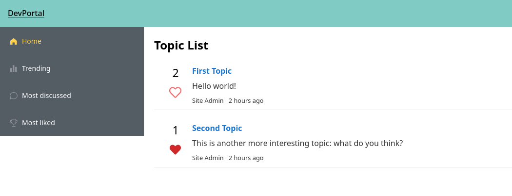

# dev-portal-frontend



## Description

Frontend for [dev-portal](https://github.com/denysvitali/dev-portal), a StackOverflow / Reddit / Disqus / Talkyard clone that aims at being the followings:

- Knowledge Base
- Q&A portal
- Discussion platform
- Content Discovery platform
- Code search platform

... with a strong focus on productivity.


## Project Status

Still WIP.  
  
The UI is being designed based on this [Design Reference](https://github.com/denysvitali/dev-portal-designs), and the backend is developed
along the way.

---


## Project setup
```
yarn install
```

### Compiles and hot-reloads for development
```
yarn serve
```

### Compiles and minifies for production
```
yarn build
```

### Lints and fixes files
```
yarn lint
```

### Customize configuration
See [Configuration Reference](https://cli.vuejs.org/config/).
